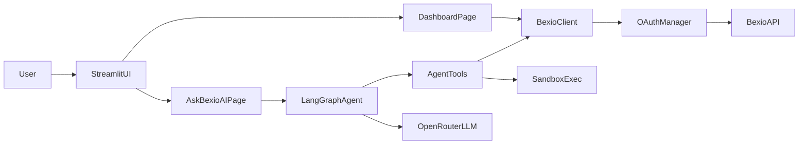

# Reportio Bexio MVP Plan

## Goals

- Deliver a working local-first Streamlit app with:
  - Bexio OAuth2 (Authorization Code + refresh)
  - Bexio data client and KPI dashboard
  - LangGraph-powered chat page with initial analytical tools
- Keep architecture extensible for future Personio/Excel integrations.

## Proposed project layout

- `x:/NewGitRepos/Reportio/app.py` (Streamlit entrypoint/router)
- `x:/NewGitRepos/Reportio/requirements.txt`
- `x:/NewGitRepos/Reportio/.env.example`
- `x:/NewGitRepos/Reportio/src/config/settings.py` (env + `st.secrets` fallback)
- `x:/NewGitRepos/Reportio/src/utils/logging.py`
- `x:/NewGitRepos/Reportio/src/utils/cache.py`
- `x:/NewGitRepos/Reportio/src/integrations/bexio/oauth.py`
- `x:/NewGitRepos/Reportio/src/integrations/bexio/client.py`
- `x:/NewGitRepos/Reportio/src/integrations/bexio/models.py`
- `x:/NewGitRepos/Reportio/src/dashboard/kpis.py`
- `x:/NewGitRepos/Reportio/src/dashboard/charts.py`
- `x:/NewGitRepos/Reportio/src/dashboard/tables.py`
- `x:/NewGitRepos/Reportio/src/agents/state.py`
- `x:/NewGitRepos/Reportio/src/agents/tools.py`
- `x:/NewGitRepos/Reportio/src/agents/graph.py`
- `x:/NewGitRepos/Reportio/src/agents/sandbox.py` (restricted dynamic execution)
- `x:/NewGitRepos/Reportio/src/pages/dashboard.py`
- `x:/NewGitRepos/Reportio/src/pages/ask_bexio_ai.py`
- `x:/NewGitRepos/Reportio/tests/` (smoke + unit tests)

## Architecture flow

## Implementation phases

### Phase 1: Foundation and configuration

- Create the package skeleton and module boundaries above.
- Add `requirements.txt` for Python 3.11+ stack (`streamlit`, `langgraph`, `langchain`, `langchain-openai` for OpenRouter-compatible chat endpoint, `httpx`, `authlib`, `plotly`, `pandas`, `python-dotenv`, `pydantic`, `tenacity`, `pytest`).
- Add `.env.example` with non-secret config keys and local defaults:
  - `BEXIO_CLIENT_ID`, `BEXIO_CLIENT_SECRET`, `BEXIO_REDIRECT_URI=http://localhost:8501`
  - `BEXIO_AUTH_BASE_URL`, `BEXIO_API_BASE_URL`
  - `OPENROUTER_API_KEY`, `OPENROUTER_MODEL`
  - cache TTL + logging level.
- Implement settings loader precedence: environment vars -> `st.secrets` -> safe defaults.

### Phase 2: Bexio OAuth and resilient API client

- Implement OAuth manager with:
  - authorization URL generation
  - callback code exchange
  - refresh token flow before expiry
  - secure token persistence in Streamlit session state (MVP) with optional local encrypted file hook for later.
- Implement `BexioClient` with typed wrappers for:
  - invoices, orders/quotes, journal entries, accounts, search.
- Add cross-cutting reliability:
  - pagination helpers
  - exponential backoff for 429/5xx
  - timeout/retry policy
  - structured errors that are user-safe in UI
  - strict log redaction (never print access/refresh tokens).
- Add TTL caching for read endpoints to reduce rate-limit pressure.

### Phase 3: Dashboard MVP (dummy first, then real)

- Build Streamlit layout with sidebar filters:
  - date presets (`This Month`, `QTD`, `YTD`, `Custom`), currency selector.
- Implement KPI cards:
  - cash in, cash out, net cashflow, open receivables, open payables, MoM trend.
- Create sections/tabs with Plotly:
  - overview charts
  - cashflow trend/waterfall
  - invoices table with multi-filter + search
  - payments section (received vs pending).
- First wire with deterministic dummy data; then switch to Bexio-backed data once OAuth session is valid.

### Phase 4: LangGraph agent MVP

- Implement graph state (messages, locale, active filters, tool results).
- Build initial tools:
  - `get_cashflow_summary`
  - `get_invoices`
  - `get_open_receivables`
  - `list_available_data`
  - plus controlled `create_dynamic_table` and `create_chart`.
- Configure OpenRouter model selection in UI (default + dropdown).
- Add bilingual system prompt (German/English) and few-shot examples for finance QA.
- Add robust tool error recovery path (tool failure -> clarified follow-up + retry suggestion).

### Phase 5: Controlled dynamic execution

- Implement a restricted execution sandbox for pandas/plotly transformations:
  - whitelist imports/modules (`pandas`, `numpy`, `plotly` only)
  - bounded execution time
  - no file/network/system access
  - result contract (must return DataFrame or Plotly figure metadata).
- Add guardrails in agent prompt and tool wrappers to force structured outputs.

### Phase 6: Quality, docs, and handoff

- Add smoke tests:
  - settings loading
  - OAuth token refresh logic
  - core KPI calculations
  - at least one agent tool invocation path.
- Add developer docs in `README.md`:
  - local setup using `venv`
  - env variables
  - OAuth callback flow
  - running Streamlit app and tests.
- Add operational notes: token handling, rate limits, and extension points for Personio/Excel adapters.

## Security and reliability defaults

- Never log credentials/tokens; redact sensitive headers.
- Use explicit request timeouts and retriable error classes.
- Prefer read-only tooling in agent graph (write actions deferred to later HITL stage).
- Fail gracefully in UI with actionable error messages and reconnect button.

## Delivery checkpoints (matching your requested sequence)

1. Skeleton + `requirements.txt` + `.env.example`
2. OAuth + `BexioClient` with refresh support
3. Dashboard layout with dummy data
4. Real Bexio data wired into invoices + basic KPIs
5. LangGraph skeleton with 2-3 tools
6. Chat page answering simple questions and rendering tables
